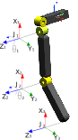

# Project Name - Test for NPCx

[Project Description]

## Table of Contents

- [Introduction](#introduction)
- [Installation](#installation)
- [Usage](#usage)
- [Features](#features)
- [Technologies Used](#technologies-used)
- [Contributing](#contributing)
- [License](#license)
- [Acknowledgments](#acknowledgments)

## Introduction

The NPCxTest Solution is a project aimed at resolving the problems presented in the Test Dev.pdf document. The main goal is to characterize the movement of a 2 DoF link skeleton using different coordinate systems and virtual markers.

The project includes the following key components:

Calculation of the homogeneous matrix for a 2 DoF link skeleton using Matlab in the NPCxTest_TCD folder.
Implementation of the solution code in C++ using Visual Studio 2022 and OpenGL for animation.
Utilization of the Eigen library for optimized matrix calculations.

## Installation

To run the project, follow these steps:

Clone the repository to your local machine using the command:

git clone https://github.com/[username]/[repository-name].git

Open the project in Visual Studio 2022.

Make sure to have all the required dependencies installed, including OpenGL, GLFW, and the Eigen library.

Build and compile the project in Visual Studio.

## Usage

[The project provides an animation that visualizes the movement of the 2 DoF link skeleton based on the data provided. The animation shows the positions of the joints and the links between them, also the user can visualize the link lenghts each frame and the total deviation at the end of the animation.

Upon running the project, the animation window will display the 2 DoF link skeleton, and you can use the mouse to control the view and zoom [feature on test]. The animation will display the calculated positions of joints j0, j1, and j2 based on the provided data.]

## Features

[Calculation of the homogeneous matrix for the 2 DoF link skeleton using Matlab in the NPCxTest_TCD folder.
Real-time animation of the 2 DoF link skeleton using OpenGL.
Dynamic control of the animation view and zoom with the mouse.
Visualization of the positions of joints j0, j1, and j2 based on the provided data.]

## Technologies Used

[List the technologies, libraries, and tools used to develop the project.]

- C++
- OpenGL
- GLFW
- Eigen

## Contributing

[Contributions to the project are welcome! If you find any issues or have suggestions for improvements, feel free to submit a pull request or open an issue.]

## License

[The NPCxTest Solution is open-source software released under My License, use it with the apropiate reference to this GitHub account]

## Acknowledgments

[The Test Dev.pdf document for providing the problem statement and requirements.
The Eigen library for enabling efficient matrix calculations.
The OpenGL and GLFW libraries for rendering the animation.
The contributors and developers of the libraries and tools used in this project.]
